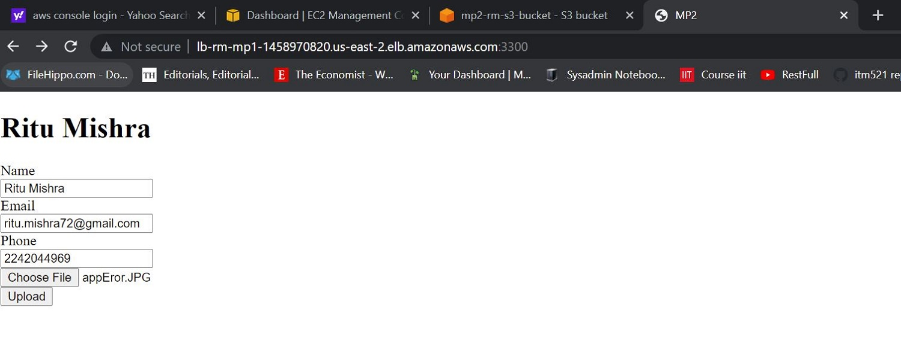
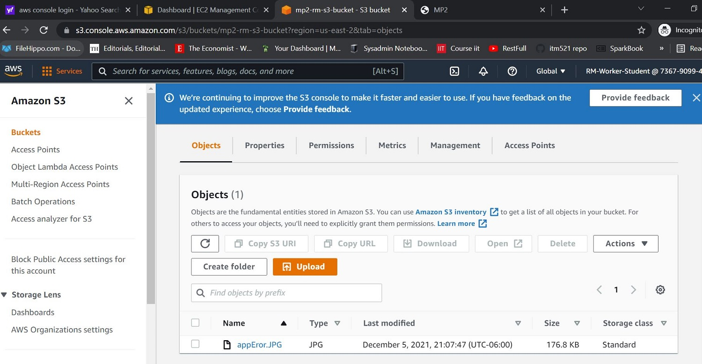
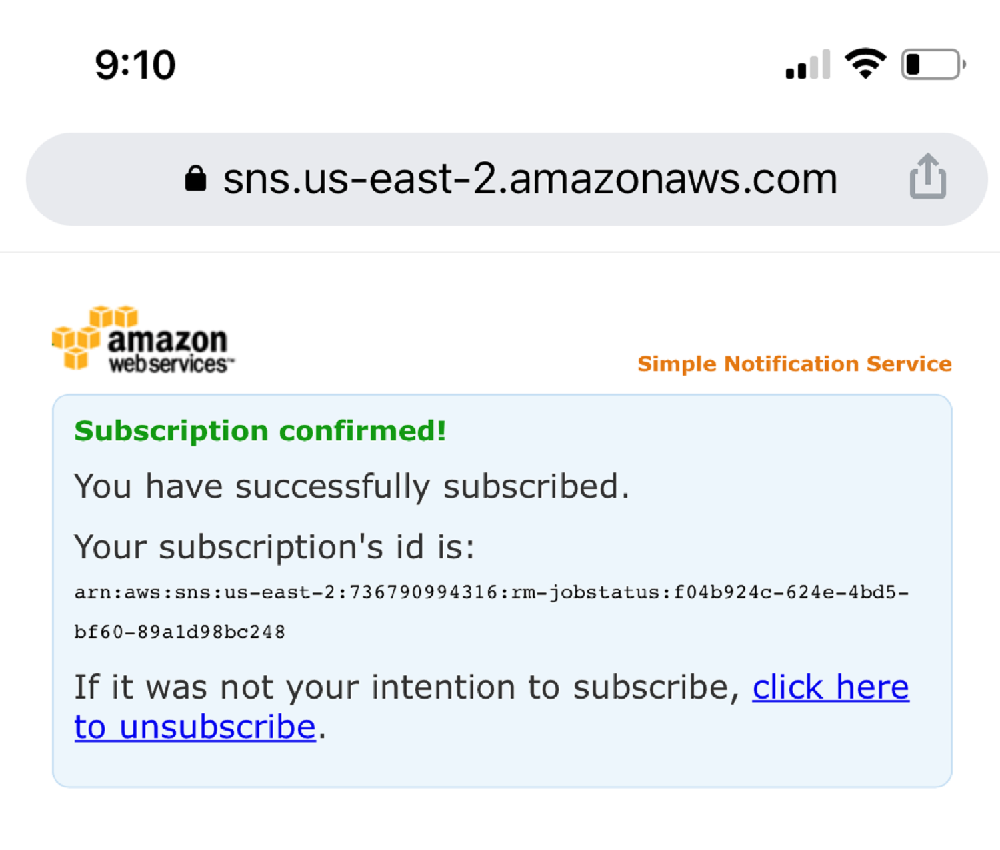
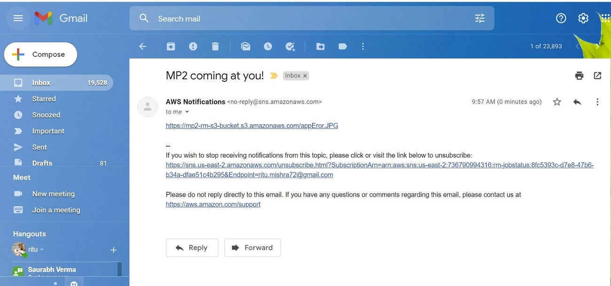

# MP2 (Week-014) Lab

## Objectives

* Understand how to create a custom AMI
* Understand how to create a iam-instance-profile and understand how privilleges interact with profiles
* Understand how to instantiate and deploy a DynamoDB NoSQL database
* Understand how to deploy a simple 3-tier Web App
* Understand cloud native messaging and notifications using SNS
* Continue to grow in our understanding of immutable infrastructure and cloud-native application deployment

## Outcomes

At the conclusion of this lab, you will have further deployed various cloud-native paradigms. You will have experience with custom AMIs, instance profile sharing, IAM credential management, as well as have gained experience with two additional cloud-native cornerstones -- NoSQL databases and Queuing services.

## Pre-req steps to set up AWS configuration

There is a bit of manual preparation needed to be done here. Manually launch a single t2.micro instance of `ami-0629230e074c580f2` and execute the following steps inside of this newly created AWS instance.

* Execute the command: `ssh-keygen`
  * Enter the following value at the first prompt: `/home/ubuntu/.ssh/id_rsa_github_deploy_key`
  * Hit enter to accept the default (blank) values for the passphrase questions.  
* Execute the command: `cat /home/ubuntu/.ssh/id_rsa_github_deploy_key.pub`
  * Copy the value printed on the screen and add this as a Deploy Key in your private GitHub repo
* Execute the command: `sudo sh` to gain a root shell -- you will see a **#**
  * While in the root shell, execute the command: `vim /root/.ssh/config`
  * Paste the content of the file named: `config` located in the jhajek sample code directory in the main mp2 folder
  * Exit the root shell once these steps are complete
* ~~Issue the command: `sudo poweroff` to turn off (but not terminate the instance)~~
* Assuming you have no other instances running, issue this command to retrieve instance-id:
  * 
  ~~~bash
  ID=$(aws ec2 describe-instances --query 'Reservations[*].Instances[?State.Name==`running`].InstanceId')
  ~~~

* Once the instance ID is retrieved, issue this command to create a custom AMI from the instance we just configured.
  * `CUSTOMAMI=$(aws ec2 create-image --instance-id $ID --name "JRH MP2 EC2 image")`
  * Issue the command: `echo $CUSTOMAMI` and note this AMI down.
  * $CUSTOM-AMI will store the new AMI identifier generated -- you can see this under the AMI menu item in the EC2 section of the AWS Console
  * The `--name` field is a comment so you can change that value
* Issue this command to give my account ID access to your instance (this is how I will run your instance)
  * `aws ec2 modify-image-attribute --image-id $CUSTOMAMI --launch-permission "Add=[{UserId=548002151864}]"`
* Update your `arguments.txt` file to use the value provided in $CUSTOMAMI in place of the default AMI had been using
* Open port 3000 in your security group

## MP2 components

The project will consist of configuring these components from the AWS CLI and from the JavaScript API (in application)

* DynamoDB
  * [AWS CLI](https://awscli.amazonaws.com/v2/documentation/api/latest/reference/dynamodb/index.html "DynamoDB AWS CLI website")
  * [JavaScript v2 API](https://docs.aws.amazon.com/AWSJavaScriptSDK/latest/ "Javascript AWS API website")
* SNS
  * [AWS CLI](https://awscli.amazonaws.com/v2/documentation/api/latest/reference/sns/index.html "SNS AWS CLI website")
  * [JavaScript v2 API](https://docs.aws.amazon.com/AWSJavaScriptSDK/latest/ "Javascript AWS API website")
* S3
  * [AWS CLI](https://awscli.amazonaws.com/v2/documentation/api/latest/reference/dynamodb/index.html "AWS CLI S3 website")
  * [JavaScript v2 API](https://docs.aws.amazon.com/AWSJavaScriptSDK/latest/ "Javascript AWS API website")
* IAM instance profiles
  * From the root account these can be configured

## Application Purpose

The purpose of the application, provided as app.js, is to process the contents of a form, store the image in an S3 bucket, and store a record of the event into a database.

### create-env.sh

Reuse as much as you can from mp1, removing all of the RDS and MySQL portions.  You will need to use the AWS CLI to create many items.  See sample `create-env.sh` for details.

### install-app.sh

This is where the application will be deployed.  I will give you a sample, but you need to adjust the locations in the code that reference my objects and replace names with yours.

### arguments.txt

This is where you will pass the arguments (space delimited) as follows (order is **very** important)

* image-id
* instance-type
* count
* key-name
* user-data
* Target-group name (use tg as a prefix)
* Load-balancer name (us elb and your initial as a prefix)
* iam-instance-profile
* SNS topic name
* DynanmoDB name
* S3 raw bucket name (must be a unique URL so add your initials)

## Deliverables

Place the required screenshots in this document:

### app.js

Take a screenshot of the app.js rendering in the browser
  

  

### S3 bucket 

Take a screenshot of the S3 Raw bucket containing the image that was uploaded

### SNS Mail

Take a screenshot of the text message your received saying that the image was uploaded in mail

screenshot of the mail:

Push your mp2.md, create-env.sh, destroy-env.sh, and install-app.sh to a folder named **mp2** created in your itmo-444/itmo-544 directory in your private GitHub repo.

I will grade your logic by running it with my account configuration information, no hard-coded values
